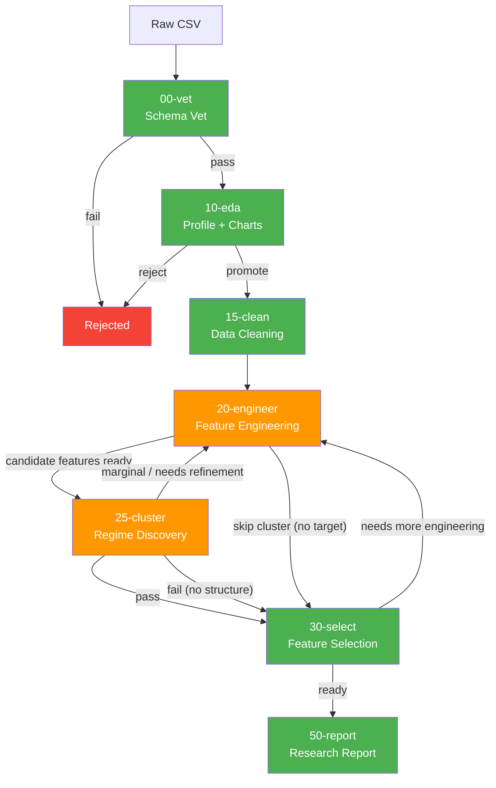

# q3d Pipeline Architecture

Autonomous research pipeline over public datasets. Seven phases, non-linear DAG with branching and cycling.

---

## Pipeline DAG



### Key non-linearities

1. **Engineer ↔ Cluster cycle**: Engineer creates candidate features → Cluster discovers regimes → if marginal, engineer refines features based on cluster feedback → re-cluster. This loop runs until clusters pass or fail definitively.

2. **Select → Engineer backtrack**: If selection reveals the feature set is insufficient, control returns to engineer for more feature creation.

3. **Cluster skip**: If no target column is identified or the data has no structure, cluster can be skipped entirely (speed-run path).

---

## Phase Details

### 00-vet — Schema Vet
**Agent**: `agents/vetter.py` | **Prompt**: `research-00-vet`

LLM judges dataset metadata + 500-row EDA profile. Gate: pass or reject.

| Input | Output |
|-------|--------|
| Portal metadata API | `artifacts/{id}/00-vet-{run_id}.md` |
| 500-row sample | DB: datasets, runs |
| `basic_profile()` | `human-notes.md` stub |

### 10-eda — Profile + EDA
**Agent**: `agents/analyst.py` | **Prompt**: `research-10-eda`

Full EDA on cached/downloaded data. Produces charts, profile tables, column assessment.

| Input | Output |
|-------|--------|
| Cached CSV (up to full) | `10-eda/run-{id}/charts/` |
| Prior vet context | `10-eda/run-{id}/tables/` (column_assessment.csv) |
| `basic_profile()`, `generate_eda_charts()` | Artifact markdown |

### 15-clean — Data Cleaning
**Agent**: `agents/cleaner.py` | **Prompt**: `research-15-clean`

Separates cleaning from engineering. Produces `clean_pipeline.py` — parse types, handle missing, flag outliers, drop useless columns. No feature creation.

| Input | Output |
|-------|--------|
| Raw CSV | `15-clean/clean_pipeline.py` |
| EDA column assessment | `15-clean/state.json` |
| Human notes | Artifact markdown |

**Boundary rule**: clean produces rawClean (same or fewer columns, fixed types). Engineer builds on top.

### 20-engineer — Feature Engineering
**Agent**: `agents/deep_analyst.py` | **Prompt**: `research-20-engineer-{plan,step,eval}`

Iterative run-based investigation. Each run: LLM plans hypothesis → generates code steps → executes → evaluates. Accumulates `pipeline.py`.

| Input | Output |
|-------|--------|
| rawClean (via clean_pipeline.py) | `20-engineer/pipeline.py` |
| Prior phase artifacts | `20-engineer/state.json` |
| Column assessment, human notes | `20-engineer/run-{id}/charts/` |

**Replay chain**: raw → clean_pipeline.py → pipeline.py

**What belongs here** (not in clean): ratios, bins, log transforms, interaction terms, aggregation indices, time features.

### 25-cluster — Regime Discovery
**Agent**: `agents/clusterer.py` | **Prompt**: `research-25-cluster`

Multi-view unsupervised clustering to find behavioral regimes.

Three clustering strategies:
- **GMM**: elliptical, covariance-aware (numeric only)
- **KPrototypes**: mixed data, spherical bias
- **UMAP + HDBSCAN**: nonlinear manifold, density-based, arbitrary shapes

Validates whether clusters define **different slopes** (genuine regimes) vs **different intercepts** (level differences only).

| Input | Output |
|-------|--------|
| Engineered features | `25-cluster/cluster_labels.csv` |
| Target column (required for regime validation) | `25-cluster/run-{id}/cluster_report.json` |
| `multi_view_cluster()`, `regime_validation()` | Multi-view comparison charts |

**Quality gates**:
- Silhouette > 0.3
- No cluster < 5% of data
- At least one feature with significant slope difference (p < 0.05)

**Target resolution**: `--target` flag > human-notes `target: col` > prior phase artifacts. No guessing.

### 30-select — Feature Selection
**Agent**: `agents/selector.py` | **Prompt**: `research-30-select`

6-stage pipeline from cheap to expensive pruning. LLM reviews and overrides.

| Input | Output |
|-------|--------|
| Clean + engineered + cluster labels | `30-select/run-{id}/feature_report.json` |
| `run_selection_pipeline()` | `30-select/run-{id}/feature_scores.csv` |
| Human notes (Track B structural) | Per-stage charts |

**Replay chain**: raw → clean_pipeline.py → pipeline.py → cluster_labels.csv

**Two-track selection**:
- Track A: Predictive features (subject to full SHAP/MI pruning)
- Track B: Structural features (bypass pruning, flagged in human-notes)

### 50-report — Research Report
**Agent**: `agents/reporter.py` | **Prompt**: `research-50-report`

Publication-ready report with OLS + LightGBM modeling, Tier 2 charts.

| Input | Output |
|-------|--------|
| Full replay chain | `50-report/run-{id}/report.md` |
| Feature report, all prior artifacts | Model charts (OLS coefficients, SHAP, partial residual) |
| `fit_ols()`, `fit_tree()` | `run_metadata.json` |

---

## Pipeline Replay Chain

Every downstream agent replays all upstream pipelines before its own work:

```
raw CSV
  │
  ├── clean_pipeline.py ──→ rawClean
  │     │
  │     ├── pipeline.py ──→ engineered df
  │     │     │
  │     │     ├── cluster_labels.csv ──→ df + cluster_label
  │     │     │     │
  │     │     │     ├── selection ──→ pruned feature set
  │     │     │     │     │
  │     │     │     │     └── modeling ──→ report
```

---

## Artifact Structure

```
artifacts/{dataset_id}/
  00-vet-{run_id}.md              ← flat artifact (no run dir)
  human-notes.md                  ← human steering, structural features
  15-clean/
    clean_pipeline.py             ← re-runnable cleaning steps
    state.json                    ← schema delta after cleaning
    15-clean-{run_id}.md          ← artifact
  10-eda/
    run-{run_id}/
      charts/                     ← EDA charts
      tables/                     ← column_assessment.csv, etc.
      10-eda-{run_id}.md
  20-engineer/
    pipeline.py                   ← cumulative feature engineering
    state.json                    ← schema delta after engineering
    run-{run_id}/
      charts/
      20-engineer-{run_id}.md
  25-cluster/
    cluster_labels.csv            ← labels for all rows
    run-{run_id}/
      charts/                     ← view comparison, sizes, target dist
      cluster_report.json         ← full quality report
      25-cluster-{run_id}.md
  30-select/
    run-{run_id}/
      charts/                     ← per-stage selection charts
      feature_report.json         ← machine-readable selection
      feature_scores.csv
      30-select-{run_id}.md
  50-report/
    run-{run_id}/
      report.md                   ← publication-ready narrative
      charts/                     ← OLS, SHAP, partial residual
      run_metadata.json
```

---

## How to Load a New Dataset

```bash
# 1. Add dataset URL to ingest config (or use ID directly)
# 2. Vet the schema
python -m agents.vetter <dataset_id>

# 3. Run EDA
python -m agents.analyst <dataset_id>

# 4. Clean
python -m agents.cleaner <dataset_id>

# 5. Engineer features (runs 1-3 investigation runs)
python -m agents.deep_analyst <dataset_id>

# 6. Discover regimes (requires target)
python -m agents.clusterer <dataset_id> --target <col>

# 7. Select features
python -m agents.selector <dataset_id>

# 8. Generate report
python -m agents.reporter <dataset_id>
```

Human steering at any point: edit `artifacts/{id}/human-notes.md`.

---

## Where Things Get Logged

| What | Where | Format |
|------|-------|--------|
| Run metadata | `observatory.db` → `runs` table | SQLite rows |
| Dataset state | `observatory.db` → `datasets` table | `max_action_code`, `rejected_at_action` |
| LLM prompts/responses | Run artifact markdown (collapsible) | Markdown + JSON |
| Pipeline transforms | `{phase}/pipeline.py` or `clean_pipeline.py` | Executable Python |
| Schema tracking | `{phase}/state.json` | JSON |
| Charts | `{phase}/run-{id}/charts/` | PNG files |
| Profile tables | `10-eda/run-{id}/tables/` | CSV files |
| Feature scores | `30-select/run-{id}/feature_scores.csv` | CSV |
| Cluster labels | `25-cluster/cluster_labels.csv` | CSV |
| Human notes | `artifacts/{id}/human-notes.md` | Markdown |

---

## Phase Registry

Single source of truth: `lib/artifacts.py:ACTIONS`

```python
ACTIONS = {
    "00": "vet",
    "10": "eda",
    "15": "clean",
    "20": "engineer",
    "25": "cluster",
    "30": "select",
    "50": "report",
}
```

All agents derive their constants from this registry. Never hardcode action codes.

---

## Cron Graduation _(proposal — not yet implemented)_

After a dataset completes the full pipeline and the report is accepted, it graduates into a **standing cron job**. The `artifacts/` investigation tree is retired.

Open questions:
- Cron notebooks likely live in a separate repo (e.g. `q3dresearch/cron-notebooks`) rather than this repo, to keep investigation artifacts separate from live outputs.
- Dataset-specific helper code (custom parsing, bespoke joins) that emerged during the artifact phase can be embedded as notebook cells rather than requiring a shared lib.

### Proposed graduated structure

```
cron/{dataset_id}/
  pipe.ipynb     ← frozen end-to-end pipeline (clean → engineer → cluster → report)
  cron.py        ← re-runs pipe.ipynb on schedule, overwrites outputs
  report.md      ← latest report (updated each run)
  tweet.txt      ← 280-char summary
  charts/        ← latest figures (overwritten each run)
```

### Proposed graduation criteria

| Type | Approval | Condition |
|---|---|---|
| `aggregate` | Auto | All phases pass, 0 unresolved concerns |
| `transactional` | Human | One manual sign-off at report phase |
| `reference` | Never | Join-enrichment only, no standalone pipeline |

---

## Stack

- Python 3.12, SQLite (`observatory.db`), OpenRouter (gemini-flash)
- matplotlib, pandas, httpx, statsmodels
- scikit-learn, lightgbm, shap, hdbscan, umap-learn, kmodes
