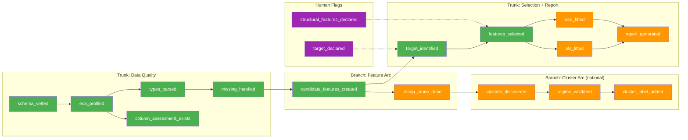

# Run Memory / Flag System

Visual novel-style route unlocking for the research pipeline.

---

## Concept

Each dataset accumulates **flags** as phases complete. Flags track what has been discovered, validated, and what routes are available next.

Like a visual novel:
- **Locked routes** require specific flags to unlock
- **Speed-run** skips optional flags (faster but shallower analysis)
- **True ending** requires all flags (complete, publication-quality analysis)

---

## Route Map



---

## Flag Catalog

### Set by vet (00)
| Flag | Required for | Description |
|------|-------------|-------------|
| `schema_vetted` | eda | Dataset schema judged by LLM |

### Set by eda (10)
| Flag | Required for | Description |
|------|-------------|-------------|
| `eda_profiled` | clean | Full EDA profile completed |
| `column_assessment_exists` | clean, engineer | Column assessment CSV produced |

### Set by clean (15)
| Flag | Required for | Description |
|------|-------------|-------------|
| `types_parsed` | engineer | String columns parsed to usable types |
| `missing_handled` | engineer | Missing values addressed |
| `outliers_flagged` | — | Outliers identified and flagged |

### Set by engineer (20)
| Flag | Required for | Description |
|------|-------------|-------------|
| `candidate_features_created` | cluster, select | Candidate columns produced |
| `cheap_prune_done` | cluster | Zero-variance / high-missing removed |
| `log_target_created` | — | Log-transformed target exists |
| `interaction_terms_created` | — | Interaction terms created |

### Set by cluster (25)
| Flag | Required for | Description |
|------|-------------|-------------|
| `clusters_discovered` | — | Meaningful clusters found |
| `regime_validated` | — | Different slopes across clusters confirmed |
| `cluster_label_added` | — | cluster_label added as Track B feature |

### Set by select (30)
| Flag | Required for | Description |
|------|-------------|-------------|
| `target_identified` | report | Target column explicitly identified |
| `features_selected` | report | Final feature set determined |
| `structural_features_preserved` | — | Track B features retained |

### Set by report (50)
| Flag | Required for | Description |
|------|-------------|-------------|
| `ols_fitted` | — | OLS model fitted |
| `tree_fitted` | — | LightGBM model fitted |
| `report_generated` | — | Publication-ready report generated |

### Set by human
| Flag | Required for | Description |
|------|-------------|-------------|
| `target_declared` | cluster | Human specified target in human-notes |
| `structural_features_declared` | — | Human listed structural features |

---

## Speed-run vs True Ending

### Speed-run path (minimum flags)
```
schema_vetted → eda_profiled → column_assessment_exists →
types_parsed → missing_handled → candidate_features_created →
target_identified → features_selected → report_generated
```
Skips: cluster arc, interaction terms, structural features, outlier flagging.

### True ending (all flags)
All 22 flags set. Includes cluster regime validation, Track B preservation, both OLS and tree models.

---

## Usage

```python
from lib.flags import set_flag, check_requirements, print_route_map

# After a phase completes:
set_flag(dataset_id, "schema_vetted", run_id=run_id, detail="pass, score=8")

# Before starting a phase:
req = check_requirements(dataset_id, "engineer")
if not req["can_proceed"]:
    print(f"Missing: {req['missing']}")
if req["speedrun"]:
    print("Speed-running — optional flags missing")

# Overview:
print_route_map(dataset_id)
```

---

## Storage

Flags stored in `artifacts/{dataset_id}/flags.json`:

```json
{
  "flags": {
    "schema_vetted": {
      "set_at": "2026-03-31T10:00:00+00:00",
      "set_by": "vet",
      "run_id": "0331-100000",
      "detail": "pass, score=8"
    }
  },
  "history": [
    {"flag": "schema_vetted", "action": "set", "timestamp": "...", "run_id": "...", "detail": "..."}
  ]
}
```

History is append-only — tracks when flags were set and unset (for re-runs that invalidate prior results).
