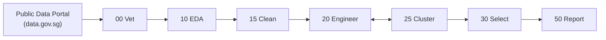

# q3d Open Research

Autonomous AI research pipeline that discovers, vets, analyzes, and produces publication-ready reports on public datasets — with a human in the loop at every meaningful decision point.

---

## Pipeline



Each phase has a dedicated agent. The engineer ↔ cluster loop runs until regimes are validated or definitively absent. Every downstream agent **replays** all upstream transforms from raw CSV — no cached state is trusted.

---

## Quick start

```bash
# Vet a dataset from data.gov.sg
python -m agents.vetter d_8b84c4ee58e3cfc0ece0d773c8ca6abc

# Run the full pipeline
python -m agents.analyst    d_8b84c4ee58e3cfc0ece0d773c8ca6abc
python -m agents.cleaner    d_8b84c4ee58e3cfc0ece0d773c8ca6abc
python -m agents.deep_analyst d_8b84c4ee58e3cfc0ece0d773c8ca6abc
python -m agents.clusterer  d_8b84c4ee58e3cfc0ece0d773c8ca6abc --target resale_price
python -m agents.selector   d_8b84c4ee58e3cfc0ece0d773c8ca6abc
python -m agents.reporter   d_8b84c4ee58e3cfc0ece0d773c8ca6abc
```

Or use the GUI:

```bash
streamlit run app/app.py
```

---

## Seven phases

| Code | Phase | Agent | What it does |
|------|-------|-------|-------------|
| 00 | **vet** | `agents/vetter.py` | Schema quality gate — LLM judges metadata + 500-row profile |
| 10 | **eda** | `agents/analyst.py` | Full profile, charts, column assessment |
| 15 | **clean** | `agents/cleaner.py` | Parse types, handle missing, flag outliers → `clean_pipeline.py` |
| 20 | **engineer** | `agents/deep_analyst.py` | Iterative feature hypotheses → `pipeline.py` |
| 25 | **cluster** | `agents/clusterer.py` | Regime discovery: GMM / KPrototypes / UMAP+HDBSCAN |
| 30 | **select** | `agents/selector.py` | 6-stage selection, Track A (predictive) + Track B (structural) |
| 50 | **report** | `agents/reporter.py` | OLS + LightGBM, publication markdown + column glossary |

---

## Design principles

- **Honest failures** — null results and "no signal" are valid outputs
- **Good decisions over good predictions** — structural features survive even with low SHAP
- **Two-track selection** — Track A (predictive, prunable) vs Track B (structural, bypass pruning)
- **Regime-aware modeling** — clusters test whether subgroups have genuinely different relationships with the target
- **Human in the loop** — `artifacts/{id}/human-notes.md` steers every phase
- **Replay chain** — raw → `clean_pipeline.py` → `pipeline.py` → `cluster_labels.csv` → modeling
- **Pipeline types** — datasets route to the right pipeline (`transactional` / `aggregate` / `reference`) rather than failing
