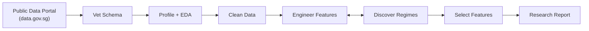

# q3d Open Research

Autonomous AI research pipeline that discovers, vets, analyzes, and produces publication-ready reports on public datasets — with no human required until the final approval gate.

---

## What it does



The pipeline runs seven phases, each with a dedicated AI agent. Phases can **cycle** (engineer ↔ cluster) until regimes are validated, then advance to the next trunk phase.

---

## Quick start

```bash
# Vet a dataset from data.gov.sg
python -m agents.vetter d_8b84c4ee58e3cfc0ece0d773c8ca6abc

# Run EDA
python -m agents.analyst d_8b84c4ee58e3cfc0ece0d773c8ca6abc

# Clean → Engineer → Cluster → Select → Report
python -m agents.cleaner d_8b84c4ee58e3cfc0ece0d773c8ca6abc
python -m agents.deep_analyst d_8b84c4ee58e3cfc0ece0d773c8ca6abc
python -m agents.clusterer d_8b84c4ee58e3cfc0ece0d773c8ca6abc --target resale_price
python -m agents.selector d_8b84c4ee58e3cfc0ece0d773c8ca6abc
python -m agents.reporter d_8b84c4ee58e3cfc0ece0d773c8ca6abc
```

Check your route progress at any point:

```python
from lib.flags import print_route_map
print_route_map("d_8b84c4ee58e3cfc0ece0d773c8ca6abc")
```

---

## Seven phases

| Code | Phase | Agent | What it does |
|------|-------|-------|-------------|
| 00 | **vet** | `vetter.py` | Schema quality gate — LLM judges metadata |
| 10 | **eda** | `analyst.py` | Profile, charts, column assessment |
| 15 | **clean** | `cleaner.py` | Parse types, handle missing, flag outliers |
| 20 | **engineer** | `deep_analyst.py` | Feature engineering, iterative hypothesis runs |
| 25 | **cluster** | `clusterer.py` | Regime discovery: GMM / KPrototypes / UMAP+HDBSCAN |
| 30 | **select** | `selector.py` | 6-stage feature selection, Track A + Track B |
| 50 | **report** | `reporter.py` | OLS + LightGBM + publication markdown |

---

## Key design principles

- **Honest failures** — null results and "no signal" are valid outputs, not failures
- **No guessing** — target columns come from human-notes or prior LLM judgment, never keyword heuristics
- **Two-track selection** — Track A (predictive, prunable) vs Track B (structural, bypass pruning)
- **Regime-aware modeling** — clustering discovers if different subgroups have different relationships with the target
- **Human in the loop** — `human-notes.md` steers every phase; agents read it before acting
- **Replay chain** — every agent re-runs all upstream transforms from raw CSV, never trust cached state
